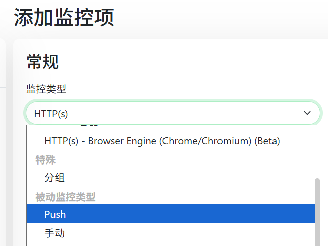
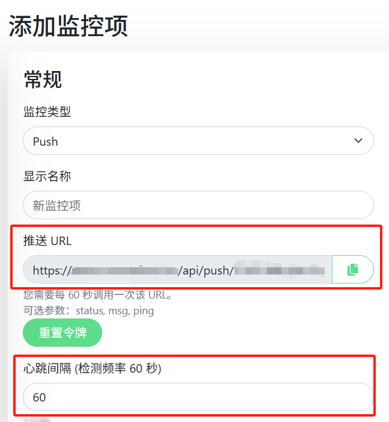
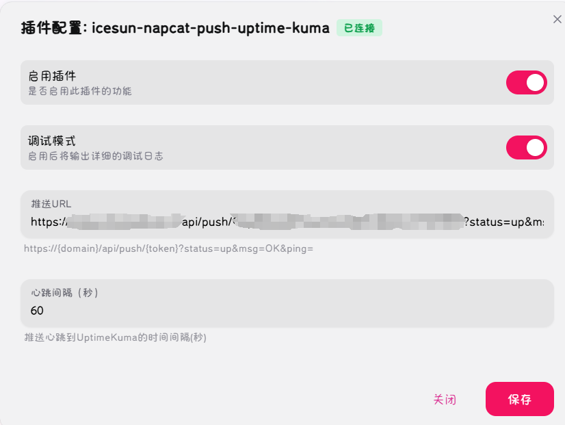

# IceSunNapCat被动推送UptimeKuma插件 (napcat-plugin-icesun-push-uptime-kuma)

## 简介

NapCat插件，用于将NapCat的基本状态通过被动push的方式推送到UptimeKuma.

## 使用说明

1. 在 UptimeKuma 中创建一个监控项, 选择类型为 "被动监控类型-Push"

2. 复制该监控项的 "推送URL" 和 "心跳间隔"

3. 在 NapCat-插件管理-插件配置 中配置该监控项的 "推送URL" 和 "心跳间隔", 并点击保存

4. 完成